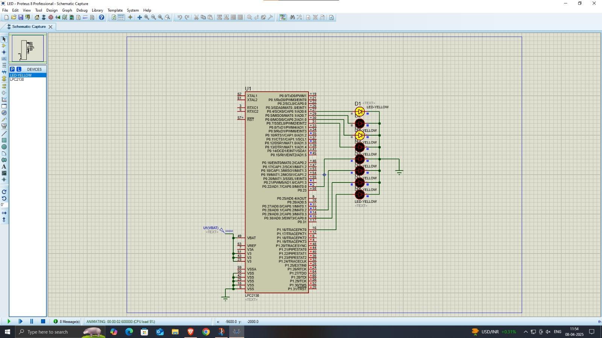

# Up/Down Counter using LPC2148
🖥️ Overview:
This project demonstrates an Up/Down counter using the LPC2148 ARM7 microcontroller and 8 LEDs. The counter value is visually represented in binary form via the LEDs, allowing real-time observation of the counting process.

🔧 Hardware Used:
- LPC2148 Microcontroller (ARM7)

- 8 Yellow LEDs

- Power Supply (VBAT)
  
- Keil uVision – For writing and compiling embedded C code.

- Proteus 8 Professional – for simulation

🔌 Working:
- LEDs are connected to GPIO pins (Port 0, Pins P0.16–P0.23).

- The microcontroller updates the LED states based on counter value.

- A software program (not shown) increments or decrements the value at regular intervals.

- One LED toggles to indicate the current binary count state.

🔁 Features:
- Binary up/down counting display.

- Real-time LED indication.

- Suitable for learning GPIO interfacing and binary logic on LPC2148.

🖼️ Schematic:
# UpDown-Counting-using-lpc2148
